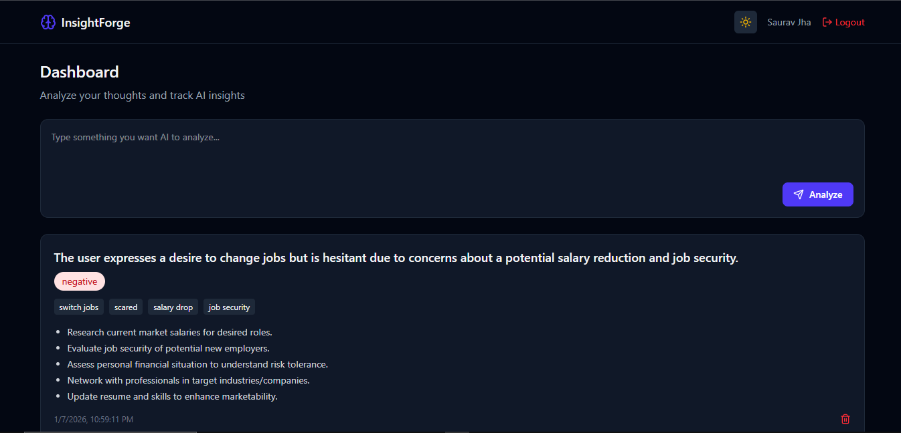
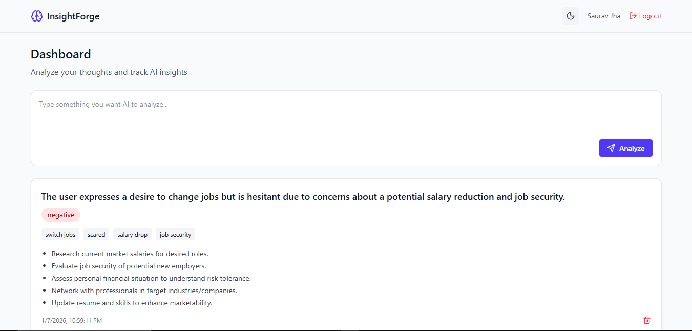

# InsightForge 🚀

InsightForge is a **full-stack web application** designed to analyze user input and generate meaningful insights through a clean UI and a robust backend system.  
This project was built to simulate **real-world production workflows**, including authentication, validation, database management, and deployment.

🔗 **Live App:** https://insightforge-nine.vercel.app  
🔗 **Frontend Repo:** (if separate, add link)  

---

## 🧠 Why InsightForge?

I built InsightForge to go beyond CRUD apps and focus on:
- Backend-heavy logic
- Clean API design
- Database modeling
- Real deployment challenges
- Handling edge cases and failures in production

This project helped me understand how real systems behave outside tutorials.

---

## ✨ Features

- User authentication (Login / Register)
- Protected routes with JWT
- Insight generation via backend services
- Form validation and error handling
- Light / Dark theme support
- Responsive UI
- Secure API communication
- Production-ready deployment

---

## 🛠 Tech Stack

**Frontend**
- React
- JavaScript (ES6+)
- HTML, CSS, Tailwind CSS
- React Router

**Backend**
- Node.js
- Express.js
- PostgreSQL
- Prisma ORM
- JWT Authentication

**DevOps / Tools**
- Docker
- Git & GitHub
- Postman
- Vercel (Frontend)
- Render (Backend)
- Neon (PostgreSQL)

---

## 🧩 Architecture Overview

- React handles client-side routing and UI
- Backend APIs manage authentication, validation, and business logic
- Prisma ORM handles database schema and queries
- Docker is used to containerize services
- Frontend and backend are deployed independently

---

## Screenshots





---

## 🚀 Running Locally

### Prerequisites
- Node.js (v18+ recommended)
- PostgreSQL
- Docker (optional)

### Setup

```bash
git clone https://github.com/jhasaurav97/insightforge.git
cd insightforge
npm install
```
Create a .env file and add:
```
DATABASE_URL=your_database_url
ACCESS_TOKEN_SECRET=your_secret_key
ACCESS_TOKEN_EXPIRY=1d

REFRESH_TOKEN_EXPIRY=your_secret_key
REFRESH_TOKEN_EXPIRY=7d
```
Run the app:
```
npm run dev
```
---

## 🧪 Real Issues Solved

- Fixed React Router refresh 404 issue on Vercel using rewrite rules
- Resolved CORS and SPA routing problems
- Handled Prisma + Docker compatibility issues
- Debugged deployment failures across multiple platforms

---

## What I Learned

- Designing APIs with scalability in mind
- Handling authentication and protected routes
- Debugging real production issues
- Structuring full-stack applications cleanly
- Deploying and maintaining apps outside localhost

---

## 👨‍💻 Author

- Saurav Jha
- Backend-leaning Full Stack Developer
🔗 GitHub: https://github.com/jhasaurav97
🔗 LinkedIn: https://www.linkedin.com/in/jha-saurav97/
